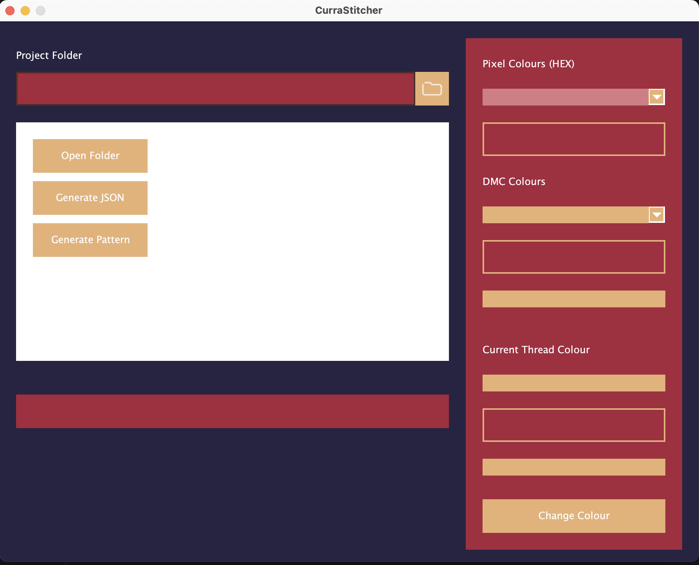
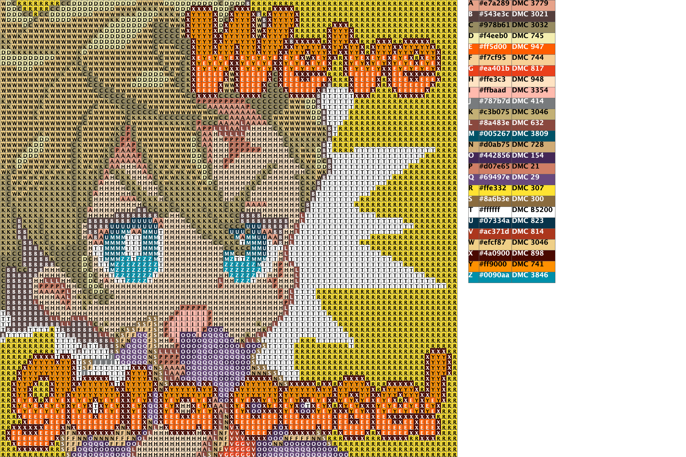

  

# CurraStitcher

## About

This is an application used to generate cross stitch patterns with an image. The image that is expected is supposed to be pixel art.

## GUI Design

This design is still tentative, but the colour scheme is meant to stay since I am using the colour scheme of the character that this application is generated for, Curran.

This was the first pattern:

## How to Use

This guide will be changed since a lot of the features will be automated later.

1. Open the GUI

2. Open a folder with the folder button near **Project Folder**. The selected folder should have an image called **Original.png**. This will be changed in the future.

3. On the right panel, each pixel colour will be shown along with their hex. In order to designate DMC colours to them, press the **Generate JSON** to create a file to store the colours (Only generates a new file if **colours.json** does not exist). This will be fixed in order to automate.

4. Modify colours to whatever you like based on DMC colour.

5. Press the **Generate Pattern** button. For the colours that do not have a DMC colour designated, only the hex colour will show.
